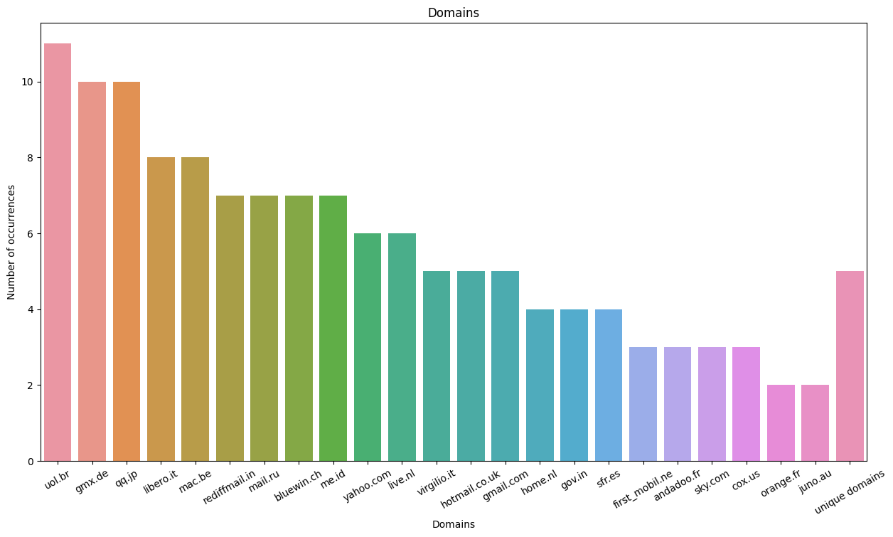
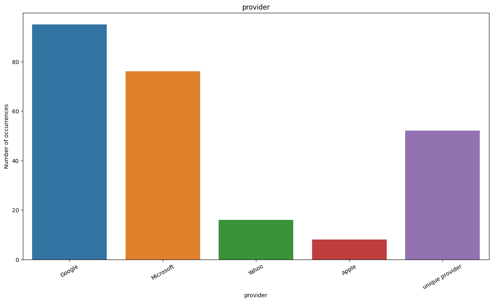
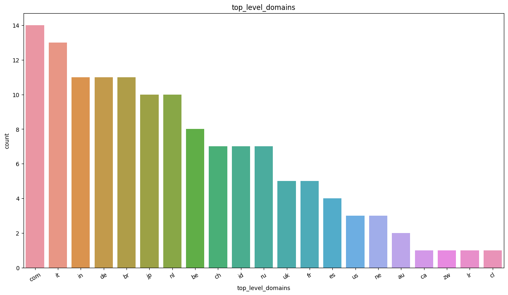
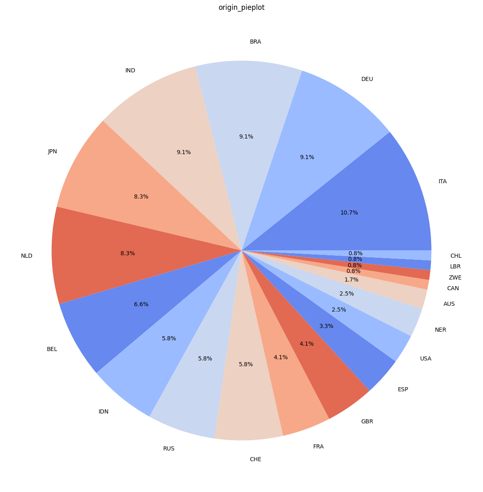
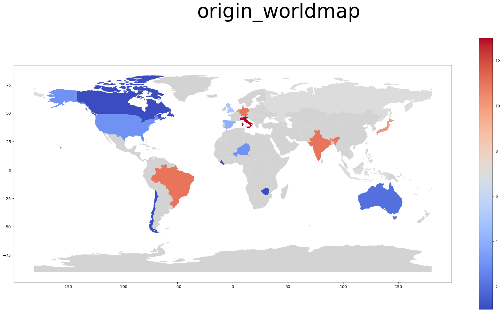

<div align="center">
  Mail Analysis
  <br />
  <a href="#about"><strong>Explore the screenshots »</strong></a>
  <br />
  <br />
  <a href="https://github.com/RobinMaas95/mail_analysis/issues/new?assignees=&labels=bug&template=01_BUG_REPORT.md&title=bug%3A+">Report a Bug</a>
  ·
  <a href="https://github.com/RobinMaas95/mail_analysis/issues/new?assignees=&labels=enhancement&template=02_FEATURE_REQUEST.md&title=feat%3A+">Request a Feature</a>
  .
  <a href="https://github.com/RobinMaas95/mail_analysis/issues/new?assignees=&labels=question&template=04_SUPPORT_QUESTION.md&title=support%3A+">Ask a Question</a>
</div>

<div align="center">
<br />

[](LICENSE)

[](https://github.com/RobinMaas95/mail_analysis/issues?q=is%3Aissue+is%3Aopen+label%3A%22help+wanted%22)
[](https://github.com/RobinMaas95)

</div>

<details open="open">
<summary>Table of Contents</summary>

- [About](#about)
  - [Built With](#built-with)
- [Getting Started](#getting-started)
  - [Prerequisites](#prerequisites)
  - [Installation](#installation)
- [Usage](#usage)
  - [Code adaptation](#code-adaptation)
  - [Run the code](#run-the-code)
- [Support](#support)
- [Contributing](#contributing)
- [License](#license)

</details>

---

## About
A small script to analyze a list of email addresses. It gives you an overview of the number of occurrences of domains, top-level-domains and countries of origin (as far as possible, manual labor may be necessary). The countries of origin are also plotted on a world map to give you a geographical impression.

<details>
<summary>Example of results for a list of generated mail addresses.</summary>
<br>

**Domain Overview:**


**Domain Provider:**

Note: Since the feature provider was added later, this plot was generated on newly generated data. Therefore, it does not match the values of the other plots.


**Top Level Domain Overview:**



**Origin Overview:**
 


**Origin World Map:**

</details>

### Built With
 - Python
    - geopandas
    - matplotlib
    - pandas
    - poetry
    - pycountry
    - seaborn


## Getting Started
### Prerequisites
- Python 3.7.6 (probably also higher versions, but not tested)
- Internet access is necessary for access to the latitude/longitude overview by [melanieshi0120]("https://raw.githubusercontent.com/melanieshi0120/COVID-19_global_time_series_panel_data/master/data/countries_latitude_longitude.csv"). Alternatively, this file can be downloaded in advance and the reference in the code adapted (COUNTRIES_LATITUDE_LONGITUDE).

### Installation
**Recommended:**
Use poetry inside the directory to create a new virtual enviroment with all necessary modules:
```shell
poetry install
```


Alternatively: Use your preferred method to install python packages and handle environments (pip, conda, venv, ...). See requirements.txt for a summary of all necessary modules.

## Usage
### Code adaptation
- Replace example mail addresses in `EMAIL_ADDRESSES_STRING` (`mail_data.py`) with your mail addresses.
- If necessary, replace examples in `GENERIC_DOMAINS_TO_COUNTRY` (`mail_data.py`) with domains relevant for you.
- If necessary, extend `COUNTRY_SPECIFIC_DOMAINS_TO_COUNTRY` (`__main__.py`) with new top-leve-domains ([PRs are welcome!](https://github.com/RobinMaas95/mail_analysis/pulls))
- If necessary, adapt the file format for the created plots `EXPORT_FILETYPE` (`__main__.pt`). E.g. pdf, png, ...
### Run the code
- Activate virtual enviroment (`poetry shell` or by selection in your editor)
- Call the script (e.g. from inside the repo directory):
```shell
python src/__main__.py
```

## Support
Reach out to the maintainer at one of the following places:

- [GitHub issues](https://github.com/RobinMaas95/mail_analysis/issues/new?assignees=&labels=question&template=04_SUPPORT_QUESTION.md&title=support%3A+)
- Contact options listed on [this GitHub profile](https://github.com/RobinMaas95)


## Contributing

First off, thanks for taking the time to contribute! Contributions are what make the open-source community such an amazing place to learn, inspire, and create. Any contributions you make will benefit everybody else and are **greatly appreciated**.


Please read [our contribution guidelines](docs/CONTRIBUTING.md), and thank you for being involved!


## License

This project is licensed under the **MIT license**.

See [LICENSE](LICENSE) for more information.

